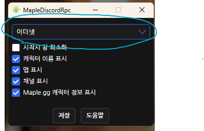
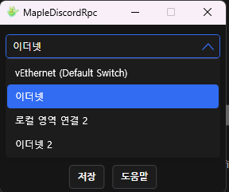

# MapleDiscordRpc
메이플스토리 디스코드 RPC


### 사용법

---

1. `MapleDiscordRpc.exe` 실행
2. 캐릭터 선택 또는 채널 변경


### 오류해결

----

#### 디스코드 상태창에 메이플스토리가 표시되지 않을때

```디스코드 설정 -> 활동 개인정보 -> 현재 활동을 상태 메시지로 표시해요 체크```


#### 디스코드 활동 표시가 켜져있는데 작동하지 않을때




1. 위 이미지에 동그라미 쳐져있는 부분 클릭

   



2. 하나씩 클릭후 채널 변경 (디스코드에 제대로 뜰때까지 하나씩 해보기)
3. 작동하면 저장하기


### 오류 문의

[Issues · kokose1234/MapleDiscordRpc (github.com)](https://github.com/kokose1234/MapleDiscordRpc/issues)
